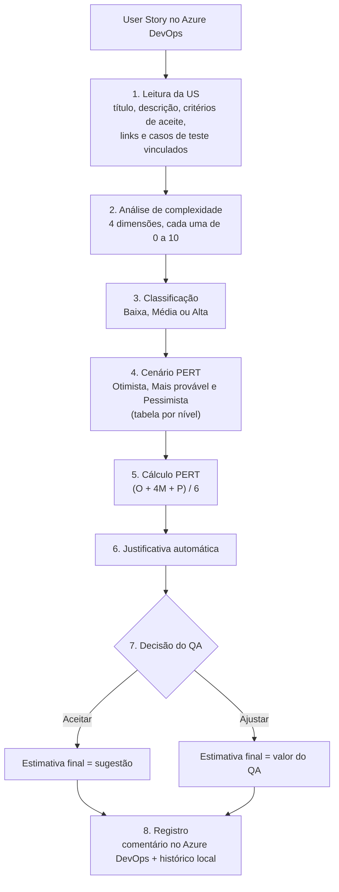

# QA Estimator

**Assistente de estimativa de esforço de testes, integrado ao Azure DevOps.**

O QA Estimator lê uma User Story do Azure DevOps, mede a complexidade dela de forma objetiva,
aplica a técnica de três pontos (PERT) para sugerir uma estimativa em horas e explica como
chegou naquele número. A decisão final é sempre do QA: ele aceita a sugestão ou ajusta o valor,
e tudo fica registrado de volta na própria User Story.

> **O assistente sugere. O QA decide.**

---

## Sumário

1. [O problema que ele resolve](#1-o-problema-que-ele-resolve)
2. [Como funciona, do início ao fim](#2-como-funciona-do-início-ao-fim)
3. [Como a complexidade é calculada](#3-como-a-complexidade-é-calculada)
4. [Como o PERT é aplicado](#4-como-o-pert-é-aplicado)
5. [Exemplo completo, passo a passo](#5-exemplo-completo-passo-a-passo)
6. [A decisão do QA](#6-a-decisão-do-qa)
7. [O que é gravado no Azure DevOps](#7-o-que-é-gravado-no-azure-devops)
8. [Limitações conhecidas](#8-limitações-conhecidas)
9. [Instalação e uso](#9-instalação-e-uso)
10. [Estrutura do projeto](#10-estrutura-do-projeto)
11. [Segurança](#11-segurança)
12. [Testes](#12-testes)
13. [Como ajustar as regras](#13-como-ajustar-as-regras)
14. [Evoluções futuras](#14-evoluções-futuras)
15. [Documentação complementar e licença](#15-documentação-complementar-e-licença)

---

## 1. O problema que ele resolve

Estimar esforço de teste costuma ser subjetivo: duas pessoas olham a mesma User Story e chegam
a números diferentes, e ninguém consegue explicar depois por que escolheu 8h e não 12h.

O QA Estimator ataca isso em três frentes:

- **Padroniza o critério.** A complexidade é pontuada por regras fixas e conhecidas, não por
  "feeling".
- **Dá rastreabilidade.** Cada estimativa vem com a justificativa completa da conta, e é gravada
  na User Story junto com a decisão do QA.
- **Mantém o QA no comando.** A ferramenta é um ponto de partida embasado, não um substituto do
  julgamento profissional.

### O que ele é e o que ele não é

O motor **não usa inteligência artificial nem machine learning**. É um algoritmo
**determinístico**: conta palavras-chave, itens de lista e tamanho de texto, e aplica pesos
fixos. Isso é intencional:

- a mesma User Story **sempre** gera a mesma pontuação (reprodutível);
- é possível explicar cada ponto do resultado (auditável);
- não existe caixa-preta: qualquer pessoa consegue conferir a conta.

---

## 2. Como funciona, do início ao fim



Resumindo em uma frase: **a User Story é pontuada, a pontuação define o nível de complexidade,
o nível define os três cenários de horas, e o PERT transforma esses três cenários em uma única
estimativa.**

---

## 3. Como a complexidade é calculada

A complexidade é a soma de **quatro dimensões independentes**. Cada dimensão vai de 0 a 10
pontos (o valor é limitado a 10), então o total teórico vai de **0 a 40**.

O código está em [src/analysis/complexityAnalyzer.js](src/analysis/complexityAnalyzer.js).

### Dimensão 1: Funcional

Mede o quanto a User Story tem de **regra de negócio, fluxos, validações e cálculos**.

O sistema procura estas palavras-chave na descrição e nos critérios de aceite:

> regra de negócio, regras de negócio, validação, validações, validar, cálculo, calcular, fluxo,
> condição, condicional, se, então, cenário, exceção, exceções

```
pontos = (termos encontrados × 0,6) + (itens de lista nos critérios de aceite × 0,5)
```

### Dimensão 2: Técnica

Mede **integrações, APIs, serviços e processamento assíncrono**. Termos procurados:

> integração, integrações, api, serviço, serviços, endpoint, assíncrono, assíncrona, fila,
> webhook, batch, microsserviço, banco de dados, terceiro, terceiros, autenticação, token

Também conta os **links relacionados** à User Story (pai, filhos, relacionados), que sugerem
dependência de outras áreas.

```
pontos = (termos técnicos × 0,8) + (links relacionados × 0,7)
```

### Dimensão 3: Escopo

Mede o **tamanho do trabalho**: quantos critérios de aceite existem e quão longa é a descrição.

```
pontos = mín(6, nº de critérios de aceite) + mín(4, palavras da descrição ÷ 60)
```

Ou seja: cada critério vale 1 ponto (até 6) e cada 60 palavras de descrição valem 1 ponto
(até 4).

### Dimensão 4: Casos de teste

Mede o **volume de casos de teste** envolvido. O sistema conta os casos já vinculados à User
Story e estima quantos ainda precisam ser criados, assumindo **2 casos por critério de aceite**
(um cenário positivo e um negativo), descontando os que já existem.

```
casos a criar = máx(0, critérios de aceite × 2 − casos já vinculados)
pontos        = (casos já vinculados × 0,4) + (casos a criar × 0,5)
```

### Total e classificação

```
total = funcional + técnica + escopo + casos de teste        (0 a 40)
```

| Pontuação total | Complexidade |
|:---:|:---:|
| menor que 8 | **Baixa** |
| de 8 até menos de 18 | **Média** |
| 18 ou mais | **Alta** |

Esses limiares ficam em [src/shared/constants.js](src/shared/constants.js).

### Resumo dos pesos

| Dimensão | O que conta | Peso |
|---|---|:---:|
| Funcional | termo de regra/fluxo/validação/cálculo | 0,6 |
| Funcional | item de lista nos critérios de aceite | 0,5 |
| Técnica | termo técnico | 0,8 |
| Técnica | link relacionado | 0,7 |
| Escopo | critério de aceite (máx. 6) | 1,0 |
| Escopo | a cada 60 palavras de descrição (máx. 4) | 1,0 |
| Casos de teste | caso já vinculado | 0,4 |
| Casos de teste | caso novo estimado | 0,5 |

---

## 4. Como o PERT é aplicado

Um ponto importante para entender a ferramenta: **o sistema não calcula o Otimista, o Mais
provável e o Pessimista de cada User Story individualmente.**

O que ele faz é usar a complexidade para **escolher qual linha de uma tabela fixa** usar. Cada
nível de complexidade já tem seus três cenários definidos:

| Complexidade | Otimista (O) | Mais provável (M) | Pessimista (P) |
|:---:|:---:|:---:|:---:|
| **Baixa** | 2h | 4h | 6h |
| **Média** | 6h | 10h | 16h |
| **Alta** | 12h | 20h | 32h |

Com os três valores da linha escolhida, aplica-se a fórmula clássica da **estimativa de três
pontos (PERT)**:

```
Estimativa = (O + 4 × M + P) / 6
```

O peso 4 no cenário "mais provável" é o que torna o PERT mais robusto que uma média simples:
o resultado fica próximo do cenário mais realista, mas os extremos (melhor e pior caso) ainda
influenciam o número.

### Estimativas resultantes por nível

| Complexidade | Cálculo | Estimativa PERT |
|:---:|:---:|:---:|
| Baixa | (2 + 4×4 + 6) / 6 = 24 / 6 | **4,00h** |
| Média | (6 + 4×10 + 16) / 6 = 62 / 6 | **10,33h** |
| Alta | (12 + 4×20 + 32) / 6 = 124 / 6 | **20,67h** |

> **Sobre a origem da tabela:** os valores de O, M e P são uma **calibragem inicial**, definida
> como premissa do projeto e fixada em [src/shared/constants.js](src/shared/constants.js). Eles
> ainda não foram derivados de dados históricos reais do time. Como o app já guarda o histórico
> de cada estimativa e de cada ajuste feito pelo QA, essa tabela pode ser recalibrada no futuro
> com dados reais (veja [Evoluções futuras](#14-evoluções-futuras)).

---

## 5. Exemplo completo, passo a passo

**User Story:** *"Permitir pagamento parcelado no checkout com validação de limite e integração
com gateway"*

Dados lidos do Azure DevOps: 5 critérios de aceite, descrição com 37 palavras, 2 casos de teste
já vinculados e 3 itens relacionados.

### Passo 1: pontuar as quatro dimensões

| Dimensão | Cálculo | Pontos |
|---|---|:---:|
| Funcional | 5 termos × 0,6 + 5 itens × 0,5 | 5,5 |
| Técnica | 4 termos × 0,8 + 3 relacionados × 0,7 | 5,3 |
| Escopo | mín(6, 5) + mín(4, 37 ÷ 60) | 5,6 |
| Casos de teste | 2 vinculados × 0,4 + 8 a criar × 0,5 | 4,8 |
| **Total** | 5,5 + 5,3 + 5,6 + 4,8 | **21,2 / 40** |

Os 8 casos a criar vêm de: 5 critérios × 2 − 2 já vinculados = 8.

### Passo 2: classificar

21,2 é maior ou igual a 18, então a complexidade é **Alta**.

### Passo 3: buscar o cenário e calcular

Cenário "Alta": O = 12h, M = 20h, P = 32h.

```
(12 + 4×20 + 32) / 6 = 124 / 6 = 20,67h
```

### Passo 4: justificativa exibida na tela

```
Classificação de complexidade: Alta (pontuação total 21.2/40).
Estimativa sugerida = (O + 4M + P) / 6 = (12 + 4×20 + 32) / 6 = 20.67h.
```

### Passo 5: decisão do QA

O QA pode aceitar as **20,67h** ou ajustar (por exemplo, para 16h, porque parte dos casos de
teste já pode ser reaproveitada de outra funcionalidade).

---

## 6. A decisão do QA

Depois da sugestão, o QA escolhe uma de duas ações:

- **Aceitar sugestão:** a estimativa final é igual à sugerida.
- **Ajustar valor:** o QA informa a estimativa final. Também pode registrar o motivo do ajuste,
  que serve de contexto para calibrar o processo no futuro (o preenchimento é opcional e não
  bloqueia o registro).

A validação está em [src/services/validationService.js](src/services/validationService.js).
Ela garante que a ação seja válida e que, ao ajustar, exista um valor numérico. Também calcula a
**diferença** entre o valor sugerido e o final, que fica gravada junto.

Não é preciso informar quem decidiu: o comentário é gravado no Azure DevOps com as credenciais
do próprio QA, então a autoria já fica registrada por lá.

---

## 7. O que é gravado no Azure DevOps

Ao clicar em **Registrar no Azure DevOps**, o app faz duas coisas:

1. **Comentário estruturado na User Story.** Sempre funciona e garante a rastreabilidade.
   Contém a complexidade e a pontuação, os valores de O, M e P, a sugestão, a decisão do QA, a
   estimativa final, o motivo do ajuste (se houver), a data e o detalhamento por dimensão para
   auditoria.
2. **Campos customizados (tentativa extra).** O app tenta preencher `Custom.QAComplexity`,
   `Custom.QAPertHours` e `Custom.QAFinalEstimateHours`. Esses campos só existem se o processo
   do seu projeto os definir. Se não existirem, o app apenas avisa: **o comentário já cobre a
   rastreabilidade**.

Além disso, cada ciclo completo (User Story, análise, PERT, decisão e resultado do registro) é
salvo no **histórico local** da máquina, consultável na aba **Histórico**.

---

## 8. Limitações conhecidas

Vale conhecer para interpretar bem os resultados:

- **A análise depende da qualidade do texto.** Uma User Story bem escrita, com descrição e
  critérios de aceite completos, é pontuada com mais precisão. Uma User Story vaga ou com
  poucos critérios tende a ser classificada como mais simples do que realmente é.
- **A busca por palavras-chave é literal.** O sistema procura o trecho de texto dentro da
  descrição, sem interpretar o sentido. Um termo curto pode ser contado dentro de outra palavra
  (por exemplo, "api" dentro de "rápido"). Isso é uma aproximação e não uma leitura semântica.
- **Os cenários O/M/P são uma premissa inicial**, não uma média calculada do histórico do time.
- **O total é limitado por dimensão.** Depois de 10 pontos, uma dimensão não cresce mais, mesmo
  que a User Story tenha muito mais conteúdo naquele aspecto.
- **É uma sugestão.** Por isso existe a etapa de decisão do QA: contexto que o texto não captura
  (risco, dependências externas, conhecimento do time) deve entrar como ajuste.

---

## 9. Instalação e uso

### Pré-requisitos

- **Node.js** (versão LTS): https://nodejs.org
- Um **Personal Access Token (PAT)** do Azure DevOps com permissão de leitura e escrita em Work
  Items. Para gerar: `Seu perfil → Personal Access Tokens → New Token`.

### Abrir o app sem usar o terminal

- **Windows:** duplo clique em `Iniciar QA Estimator.bat`
- **Mac:** duplo clique em `Iniciar QA Estimator.command`

Na primeira execução as dependências são instaladas automaticamente.

### Rodar em modo desenvolvimento

```bash
npm install
npm start
```

### Primeiro uso

1. Abra a aba **Configuração** e informe a organização, o projeto e o PAT.
2. Clique em **Testar conexão** e depois em **Salvar credenciais**.
3. Abra a aba **Estimar User Story**, digite o ID da User Story e clique em **Buscar User
   Story**.
4. Confira a análise e a sugestão, escolha **Aceitar** ou **Ajustar** e clique em **Registrar
   no Azure DevOps**.

O passo a passo completo, com dúvidas comuns, está em [GUIA-DE-USO.md](GUIA-DE-USO.md).

---

## 10. Estrutura do projeto

```
qa-estimator/
├── src/
│   ├── main/            Processo principal do Electron
│   │   ├── main.js          cria a janela do app
│   │   ├── preload.js       ponte segura entre a interface e o sistema
│   │   └── ipc-handlers.js  recebe os pedidos da interface e chama os serviços
│   ├── renderer/        Interface (HTML, CSS e JavaScript puro)
│   ├── services/        Orquestração do fluxo
│   │   ├── estimationService.js   busca a US, analisa, calcula e registra
│   │   └── validationService.js   valida a decisão do QA
│   ├── analysis/
│   │   └── complexityAnalyzer.js  pontuação das 4 dimensões e classificação
│   ├── pert/
│   │   └── pertEngine.js          cálculo PERT e justificativa textual
│   ├── azuredevops/
│   │   └── client.js              cliente REST (busca a US, registra a estimativa)
│   ├── storage/
│   │   ├── credentialStore.js     credenciais criptografadas
│   │   └── historyStore.js        histórico local de estimativas
│   └── shared/
│       └── constants.js           limiares e cenários PERT centralizados
├── test/                Testes unitários
├── COMO-FUNCIONA.md     Detalhamento do algoritmo
└── GUIA-DE-USO.md       Guia para quem só quer usar o app
```

### Tecnologias

- **Electron:** transforma a interface web em aplicativo de desktop (Windows e Mac).
- **JavaScript puro** na interface, sem frameworks.
- **Axios:** comunicação com a API REST do Azure DevOps (versão 7.1).
- **node:test:** testes nativos do Node.

---

## 11. Segurança

- As credenciais (organização, projeto e PAT) são **criptografadas localmente** com o
  `safeStorage` do Electron (DPAPI no Windows, Keychain no macOS).
- Ficam em `%APPDATA%` (Windows) ou `~/Library/Application Support` (macOS), **fora da pasta do
  projeto**. Por isso nunca são versionadas nem viajam junto com o código.
- O PAT **só é enviado ao próprio Azure DevOps**, nunca a outro destino.
- Para apagar as credenciais salvas: aba **Configuração → Limpar credenciais salvas**.

---

## 12. Testes

```bash
npm test
```

Os testes ficam em [test/](test/) e cobrem:

| Arquivo | O que verifica |
|---|---|
| `complexityAnalyzer.test.js` | pontuação das dimensões e classificação |
| `pertEngine.test.js` | fórmula PERT e cenários por nível |
| `validationService.test.js` | regras da decisão do QA (aceitar/ajustar) |
| `client-normalization.test.js` | tratamento de organização e projeto informados com URL |
| `htmlEntities.test.js` | conversão do HTML do Azure DevOps para texto limpo |

---

## 13. Como ajustar as regras

| Quero mudar... | Onde |
|---|---|
| Palavras-chave e pesos de cada dimensão | [src/analysis/complexityAnalyzer.js](src/analysis/complexityAnalyzer.js) |
| Limiares Baixa/Média/Alta | [src/shared/constants.js](src/shared/constants.js) (`COMPLEXITY_THRESHOLDS`) |
| Horas de O, M e P por nível | [src/shared/constants.js](src/shared/constants.js) (`PERT_SCENARIOS`) |
| Texto da justificativa | [src/pert/pertEngine.js](src/pert/pertEngine.js) |
| Campos customizados do Azure DevOps | [src/shared/constants.js](src/shared/constants.js) (`AZURE_CUSTOM_FIELDS`) |
| Cores da interface | topo de [src/renderer/styles.css](src/renderer/styles.css) |

Depois de alterar qualquer regra, rode `npm test` para confirmar que nada quebrou.

---

## 14. Evoluções futuras

O app já **coleta** os dados necessários para evoluir, mas hoje eles não são usados
automaticamente:

- **Recalibrar a tabela de cenários** (O/M/P) com base nas estimativas finais reais.
- **Ajustar pesos e limiares** observando onde o QA mais discorda da sugestão.
- **Buscar User Stories semelhantes** no histórico para servir de referência.
- **Recomendações baseadas em histórico**, usando os ajustes e motivos já registrados.

---

## 15. Documentação complementar e licença

- [GUIA-DE-USO.md](GUIA-DE-USO.md): como usar o app, sem terminal.
- [COMO-FUNCIONA.md](COMO-FUNCIONA.md): detalhamento do algoritmo com exemplo numérico.

Distribuído sob a licença MIT. Veja o arquivo [LICENSE](LICENSE).
